# Server and Client System Configuration - Sentosa Hospital

This project involved configuring a Windows Server 2022 system and connecting it with a Windows 7 client to simulate an enterprise environment for Sentosa Hospital. The goal was to deploy core Windows Server services including Active Directory, DNS, Organization Units, User Management, Folder Permissions, Group Policies (GPOs), and a Web Server using IIS.

> 📄 [View Full Project Report (PDF)](docs/Windows_Server_Project.pdf)

## Project Highlights
- Configured Windows Server roles and features.
- Deployed a DNS Server and Active Directory Domain Services (AD DS).
- Created Organizational Units (OUs) and managed users.
- Set folder permissions through user roles.
- Applied Group Policies to enforce security settings.
- Installed and configured a Web Server using IIS.

## Tools Used
- Oracle VirtualBox
- Windows Server 2022
- Windows 7 Ultimate
- Microsoft Word, Google Drive

## Key Outcomes
- Successful server and client connection under a single domain.
- Centralized user, group, and device management.
- Enforced organizational security policies using GPOs.
- Delivered a working internal website accessible via DNS.

---

### 1. Computer Name and IP Configuration
Renamed the server's hostname to "Sentosa Group" and manually configured static IP addresses for both server and client to ensure stable network connectivity.

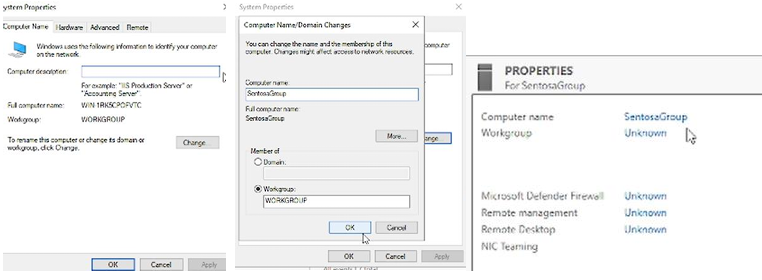
> **Figure 1:** Configuring server hostname.

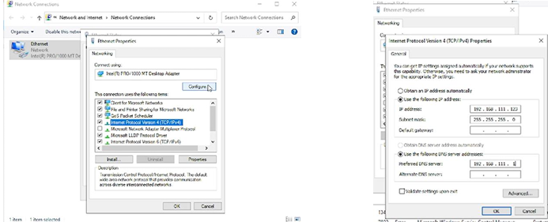
> **Figure 2:** Configuring server static IP address.

---

### 2. Active Directory and DNS Server Configuration
Installed and promoted the server to a Domain Controller. Set up DNS under the domain name `sentosahospital.com` for centralized domain management.

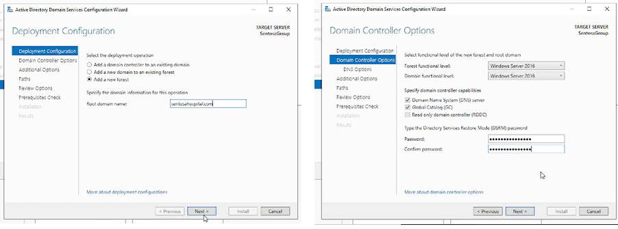
> **Figure 3:** Setting up Active Directory and DNS services.

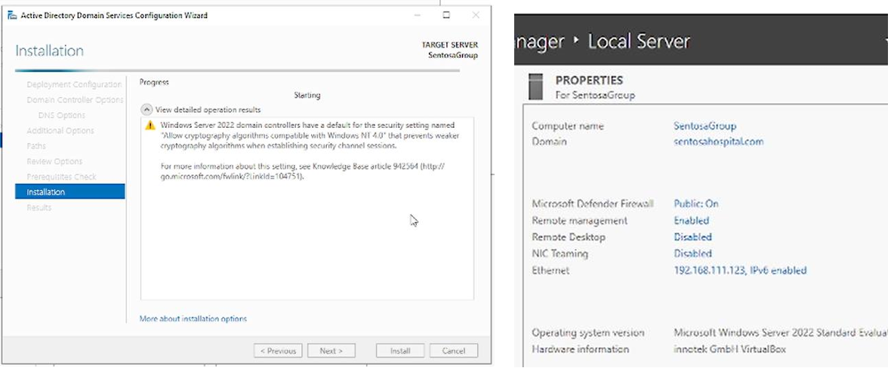
> **Figure 4:** Setting up Active Directory and DNS services.

---

### 3. Organizational Units and User Management
Created Organizational Units (OUs) and added user accounts inside Active Directory. Users were assigned proper login credentials for accessing the domain network.

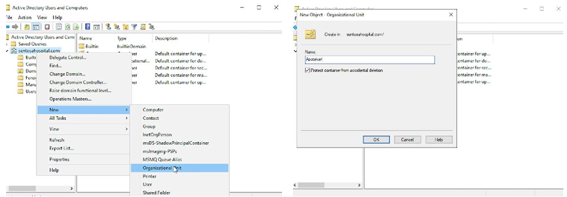
> **Figure 5:** Creation of OUs for Sentosa Hospital network.

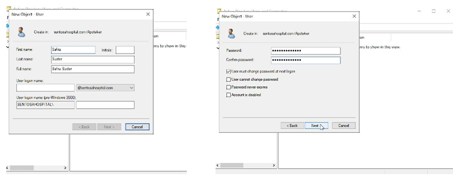
> **Figure 6:** Creation of users for Sentosa Hospital network.

---

### 4. Client Machine Domain Join
Configured the Windows 7 client machine to join the `sentosahospital.com` domain. Verified domain join by logging in with Active Directory user accounts.

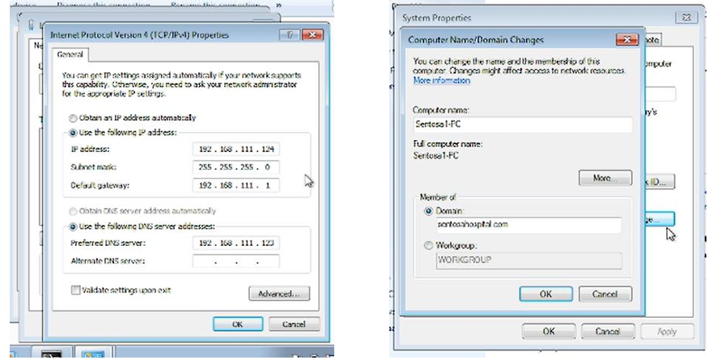
> **Figure 7:** Client log in.

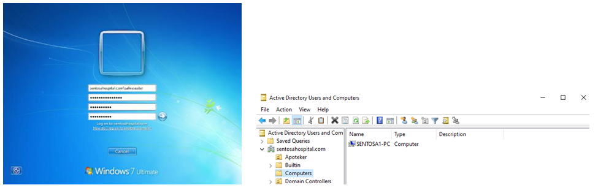
> **Figure 8:** Client successfully joined the domain network.

---

### 5. Folder Management and Permissions
Created shared folders on the server and assigned permission levels to specific users and groups via folder properties and security settings.

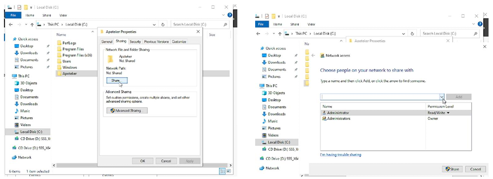
> **Figure 9:** Configuring user access and permissions to management folders.

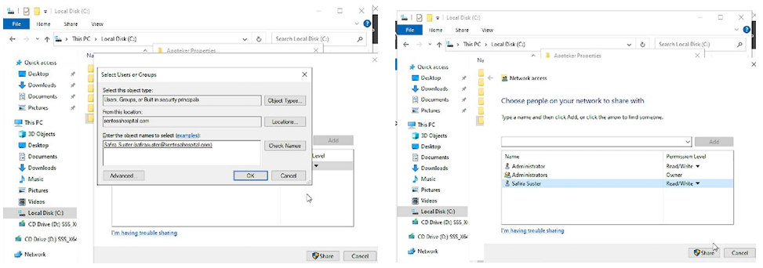
> **Figure 10:** Configuring user access and permissions to management folders.

---

### 8. Group Policy Object (GPO) Implementation
Created and applied GPOs to enforce security policies, such as disabling shutdown options and hiding system folders on client machines. In this project, 
we removed the power off, shutdown, & restart signs. Then, we also removed Pictures & music from the 
menu.

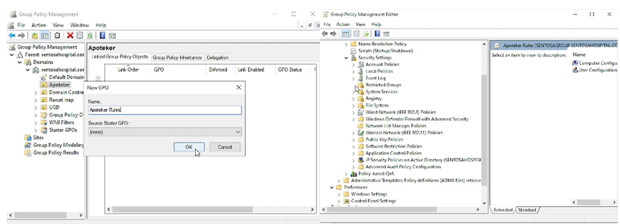
> **Figure 11:** Implementing GPOs to control user behavior on client machines.

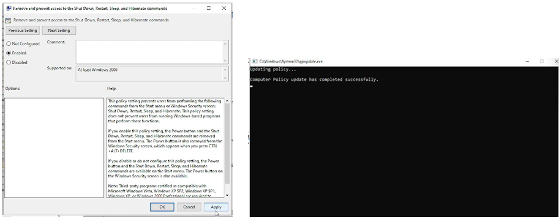
> **Figure 12:** Implementing GPOs to control user behavior on client machines.

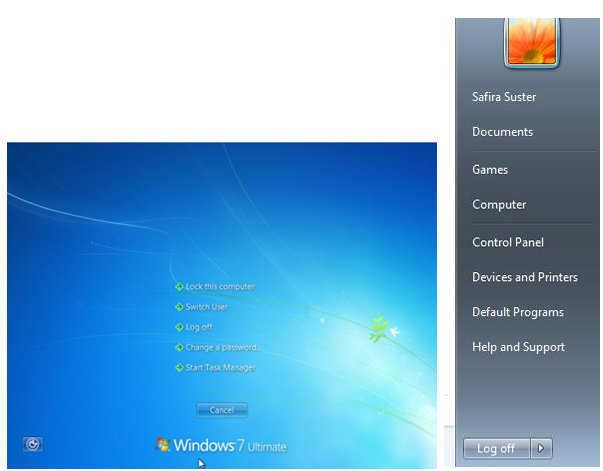
> **Figure 13:** GPOs result.

---

### 9. Web Server (IIS) Setup
Installed Internet Information Services (IIS) on the server to host an internal hospital website, accessible by client machines via DNS. Edited the 
contents of the website page with HTML.

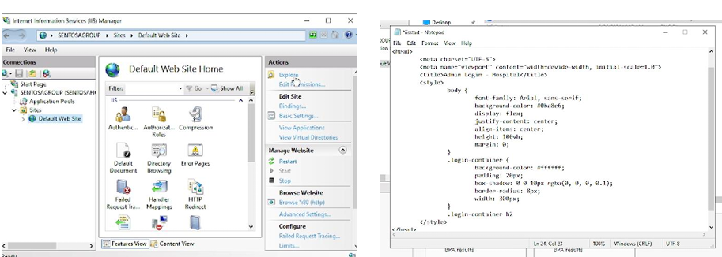
> **Figure 14:** Hosting the internal hospital web page through IIS.

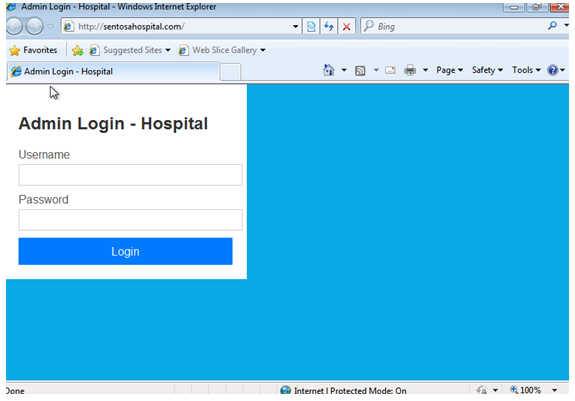
> **Figure 15:** Accessing the internal hospital web page through IIS.

---

> _"Building secure and efficient networks for better digital healthcare."_

---
